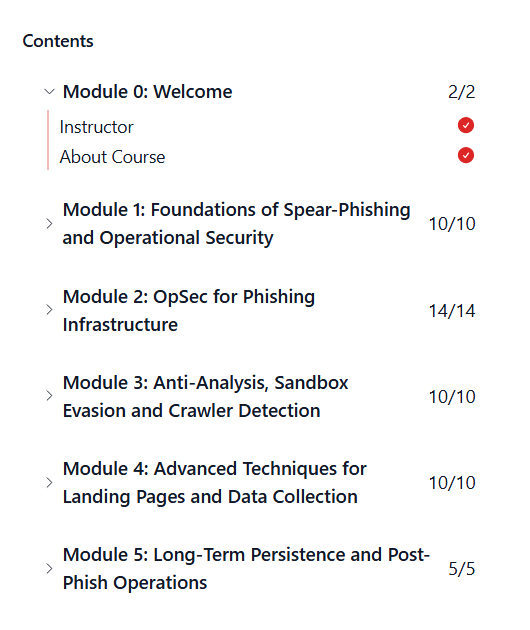

# 🎯 Spearphishing & OpSec Techniques – RedTeam Leaders

This repository contains **notes, labs, operations guidelines, extras, tracking logs, and certificate** for the  
**Spearphishing & OpSec Techniques** program.  
The course provides practical insights into **OSINT, pretexting, phishing delivery, evasion, OpSec, and red team lifecycle**.

---

## 📚 Notes  

- 📄 [01-introduction.md](./notes/01-introduction.md) – Introduction  
- 📄 [02-target-research-osint.md](./notes/02-target-research-osint.md) – Target Research & OSINT  
- 📄 [03-pretexting-and-lure-design.md](./notes/03-pretexting-and-lure-design.md) – Pretext & Lure Design  
- 📄 [04-delivery-infrastructure.md](./notes/04-delivery-infrastructure.md) – Delivery Infrastructure  
- 📄 [05-delivery-techniques.md](./notes/05-delivery-techniques.md) – Delivery Methods  
- 📄 [06-opsec-foundations.md](./notes/06-opsec-foundations.md) – OpSec Foundations  
- 📄 [07-evasion-techniques.md](./notes/07-evasion-techniques.md) – Evasion Techniques  
- 📄 [08-tracking-and-analytics.md](./notes/08-tracking-and-analytics.md) – Tracking & Analytics  
- 📄 [09-red-team-phishing-lifecycle.md](./notes/09-red-team-phishing-lifecycle.md) – Full Phishing Lifecycle  
- 📄 [10-reporting-and-lessons-learned.md](./notes/10-reporting-and-lessons-learned.md) – Reporting & Lessons Learned  

---

## 🧪 Labs  

- 🔍 [lab1-osint-corporate-mapping.md](./labs/lab1-osint-corporate-mapping.md) – Corporate Mapping  
- 🎭 [lab2-pretext-development.md](./labs/lab2-pretext-development.md) – Pretext Development  
- 🏗️ [lab3-infrastructure-opsec-lab.md](./labs/lab3-infrastructure-opsec-lab.md) – Infrastructure & OpSec  
- 🛡️ [lab4-defensive-detection-lab.md](./labs/lab4-defensive-detection-lab.md) – Defensive Detection  
- 📉 [lab5-opsec-breakdown-analysis.md](./labs/lab5-opsec-breakdown-analysis.md) – OpSec Breakdown Analysis  

---

## 📋 Extras  

- 🧠 [behavioral_models.md](./extras/behavioral_models.md) – Behavioral Models  
- ✔️ [checklists_operator.md](./extras/checklists_operator.md) – Operator Checklists  
- ❌ [opsec_failures_casebook.md](./extras/opsec_failures_casebook.md) – OpSec Failure Casebook  
- 🎭 [pretext_patterns.md](./extras/pretext_patterns.md) – Pretext Patterns & Templates  
- 🔎 [recon_blue_team_value.md](./extras/recon_blue_team_value.md) – Recon & Blue Team View  
- ✍️ [writing_style_opsec.md](./extras/writing_style_opsec.md) – Writing Style for OpSec  

---

## 🧭 Operations  

- 📘 [blue-team-procedures.md](./operations/blue-team-procedures.md) – Blue Team Procedures  
- 📜 [engagement-guidelines.md](./operations/engagement-guidelines.md) – Engagement Guidelines  
- 🏛️ [policy-alignment.md](./operations/policy-alignment.md) – Policy & Legal Alignment  
- 🧩 [scenario-planning.md](./operations/scenario-planning.md) – Scenario Planning  
- 📝 [tracking-log.md](./operations/tracking-log.md) – Tracking Log  

---

## 📖 Docs  

- 📗 [glossary.md](./docs/glossary.md) – Glossary  
- 📘 [index.md](./docs/index.md) – Index  
- 📘 [references.md](./docs/references.md) – References  
- 📘 [roadmap.md](./docs/roadmap.md) – Roadmap  
- 📘 [syllabus.md](./docs/syllabus.md) – Syllabus  

---

## 📸 Screenshots  

| Step | Screenshot |
|------|------------|
| Course Intro |  |
| Course Lessons |  |

---

## 📜 Certificate  

🎓 **Spearphishing & OpSec Techniques Certificate**  
[`Spearphishing & OpSec Techniques`](./cert/course-spearphising-and-OpSec-Techniques.png)

---

## 📝 Personal Review  

This course strengthened my **red team workflow**, especially around:

- realistic **OSINT for target research**  
- **pretext design** based on behavioral psychology  
- building **delivery infrastructure with strong OpSec**  
- designing **payload delivery strategies**  
- understanding **blue team detection pathways**  
- performing **post-engagement OpSec breakdown**  

The highlight of the course is the **detailed OpSec case studies and pretext pattern design**, which are extremely beneficial for real offensive engagements.

---

## ✍️ Author  

**Thành Danh** – Red Team Learner & Security Researcher  
- GitHub: https://github.com/ngvuthdanhh  
- Email: ngvu.thdanh@gmail.com  

---

## 📄 License  

This project is licensed under the **MIT License**.  
See [`LICENSE`](./LICENSE) for details.

© 2025 ngvuthdanhh. All rights reserved.
